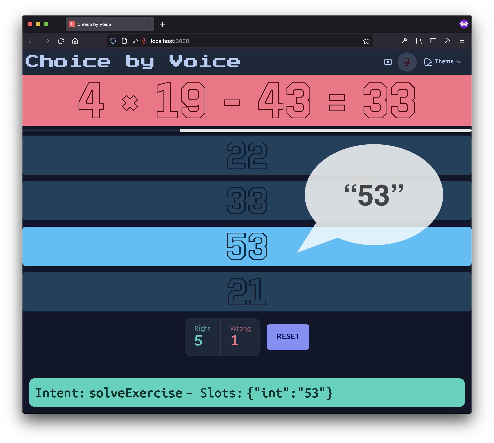
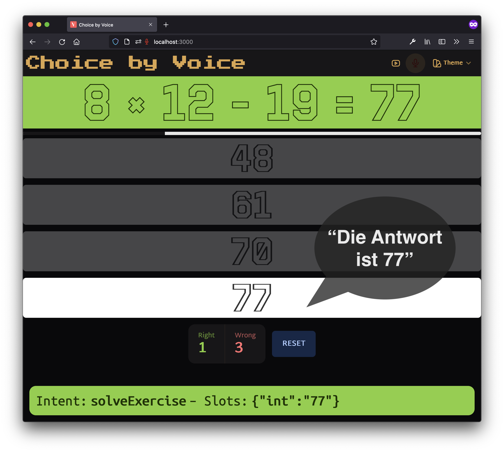
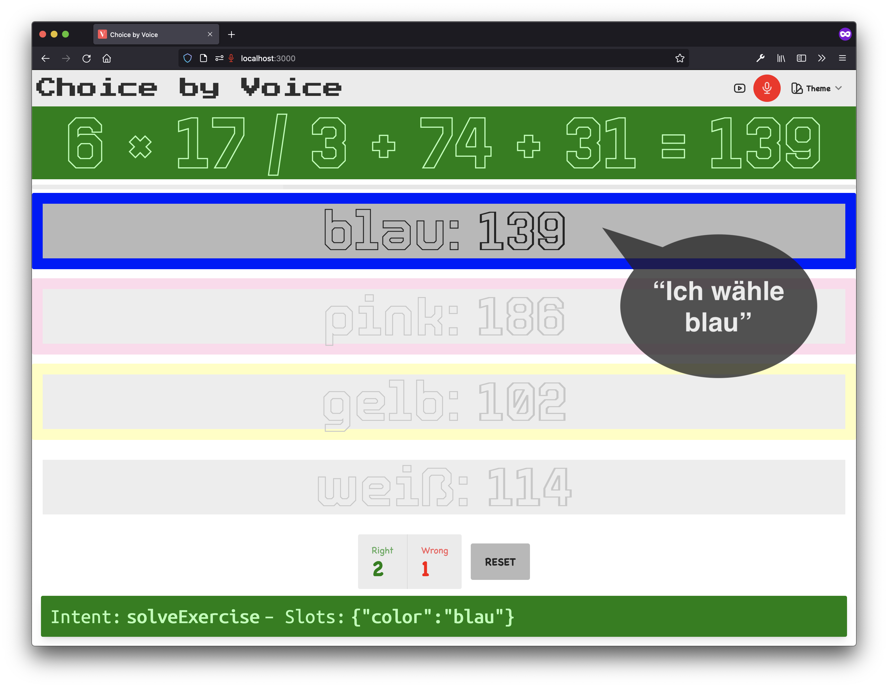
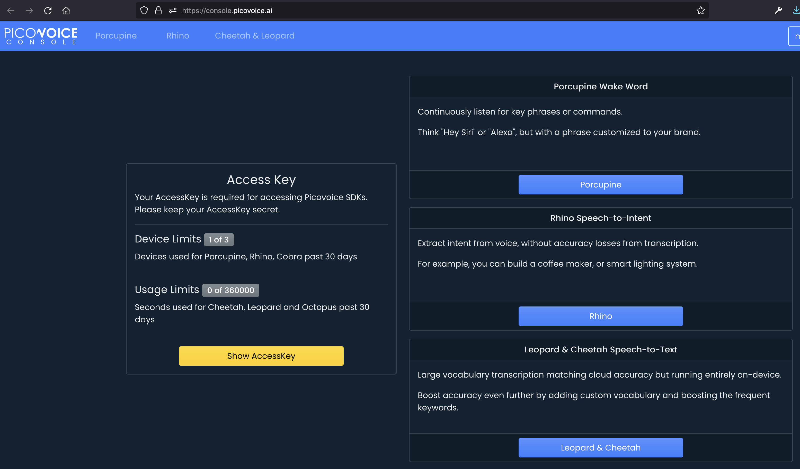

# Choice by Voice

In this web app you have to solve math problems. The special feature: It can be controlled by voice commands, **on-device in real-time** – without recording data and sending them to the cloud.







## Introduction

The app is written with [Svelte](https://svelte.dev/) and uses [Tailwind CSS](https://tailwindcss.com/) and the Tailwind CSS component library [daisyUI](https://daisyui.com/).

Our Speech-to-Intent engine is [Rhino](https://picovoice.ai/platform/rhino/) by Picovoice. It directly infers intent from spoken commands within a given context of interest. In our case, the context is solving math problems and a command could be, for example, "Die Lösung ist 42". The language AI model for this app is trained in German, but other languages such as English, French and Italian are also available.

Developers can train their own contexts using [Picovoice Console](https://console.picovoice.ai/).
You can choose from a variety of target platforms, such as Raspberry Pi, iOS, Android or WebAssembly (WASM), which is what this web app uses.

## Run

Steps 1 and 2 are only required once.

### Step 1: Get a Picovoice Access Key

An access key is required for accessing Picovoice SDKs. Picovoice offers Rhino, the engine used in our app to offline extract intents from voice.

Sign up for [Picovoice Console](https://console.picovoice.ai/). It is free, no credit card required. Then log in to your account and click on the _Show AccessKey_ button.



### Step 2: Paste the Access Key

Copy the `.env.sample` file in your root directory and name it `.env`. Paste your access key here.

> ❗️ Note: You must keep your access key secret! In the implementation of the demo app here, however, the key becomes part of the build. Keep this in mind before deploying the app anywhere.

### Step 3: Run the App

```sh
# Before first start
$ npm i

$ npm run dev
```

Open http://localhost:3000 in your browser. In `/src/appSettings.ts` you can make some settings, e.g. the complexity of the math problems, the number of multiple choice options or the speech-to-text sensitivity.
